# Examen Big Data

## SDIA: le 13 Janvier 2025
## Fait par : **`Omar Trkzi`**

### **Exercice 1** : _HDFS_

  - Installez **HDFS** en utilisant **Docker**. Fournissez les commandes Docker utilisées.  
   ```bash
    # Créer un réseau Docker pour notre cluster HDFS
    sudo docker network create --driver bridge hadoopnet

    # Démarrer le NameNode avec des variables d'environnement appropriées
    sudo docker run -d --name namenode --network hadoopnet \
        -p 9870:9870 -p 9000:9000 \
        -e CLUSTER_NAME=hadoop-cluster \
        -e CORE_CONF_fs_defaultFS=hdfs://namenode:9000 \
        -e CORE_CONF_hadoop_http_staticuser_user=root \
        -e HDFS_CONF_dfs_webhdfs_enabled=true \
        -e HDFS_CONF_dfs_permissions_enabled=false \
        bde2020/hadoop-namenode:2.0.0-hadoop3.2.1-java8

    # Démarrer les DataNodes avec la configuration appropriée
    sudo docker run -d --name datanode1 --network hadoopnet \
        -e SERVICE_PRECONDITION="namenode:9870" \
        -e CORE_CONF_fs_defaultFS=hdfs://namenode:9000 \
        -e CORE_CONF_hadoop_http_staticuser_user=root \
        bde2020/hadoop-datanode:2.0.0-hadoop3.2.1-java8

    sudo docker run -d --name datanode2 --network hadoopnet \
        -e SERVICE_PRECONDITION="namenode:9870" \
        -e CORE_CONF_fs_defaultFS=hdfs://namenode:9000 \
        -e CORE_CONF_hadoop_http_staticuser_user=root \
        bde2020/hadoop-datanode:2.0.0-hadoop3.2.1-java8
   ```
  - Configurez un cluster **HDFS** simple avec un **NameNode** et deux **DataNodes**.  
   ```bash
    # Vérifier que les conteneurs sont en cours d'exécution
    sudo docker ps

    # Vérifier l'état du cluster HDFS
    sudo docker exec -it namenode hdfs dfsadmin -report
   ```
  - Importez un fichier texte (CSV) contenant des informations de ventes (colonnes : `transaction_id, user_id, product_id, timestamp, amount`) dans **HDFS**. Montrez les commandes utilisées pour importer le fichier et vérifier son existence dans HDFS.  
   ```bash
    # Création du fichier de ventes
    cat << 'EOF' > sales.csv
    transaction_id,user_id,product_id,timestamp,amount
    1001,user123,prod456,2024-03-20 10:30:00,150.50
    1002,user124,prod789,2024-03-20 10:35:00,75.25
    1003,user125,prod456,2024-03-20 10:40:00,200.00
    1004,user126,prod123,2024-03-20 10:45:00,99.99
    1005,user127,prod456,2024-03-20 10:50:00,175.75
    EOF

    # Copier le fichier dans le conteneur NameNode
    sudo docker cp sales.csv namenode:/tmp/

    # Créer le répertoire et importer le fichier dans HDFS
    sudo docker exec -it namenode bash
    hdfs dfs -mkdir -p /data/sales
    hdfs dfs -put /tmp/sales.csv /data/sales/
   ```
  - Listez le contenu du répertoire **HDFS**, lisez le début du fichier importé, puis copiez ce fichier vers un autre répertoire dans **HDFS**. Fournissez les commandes et leurs sorties.  
   ```bash
    # Lister le contenu du répertoire
    hdfs dfs -ls /data/sales/

    # Lire les premières lignes du fichier
    hdfs dfs -cat /data/sales/sales.csv | head -n 3
   ```
  - Configurez la réplication du fichier importé avec un **facteur de réplication de 3**. Vérifiez et montrez que la réplication est correctement configurée.  
   ```bash
    # Configurer le facteur de réplication
    hdfs dfs -setrep 3 /data/sales/sales.csv

    # Vérifier la configuration de réplication
    hdfs dfs -ls -R /data/sales/
   ```

   - Image HDFS :  
   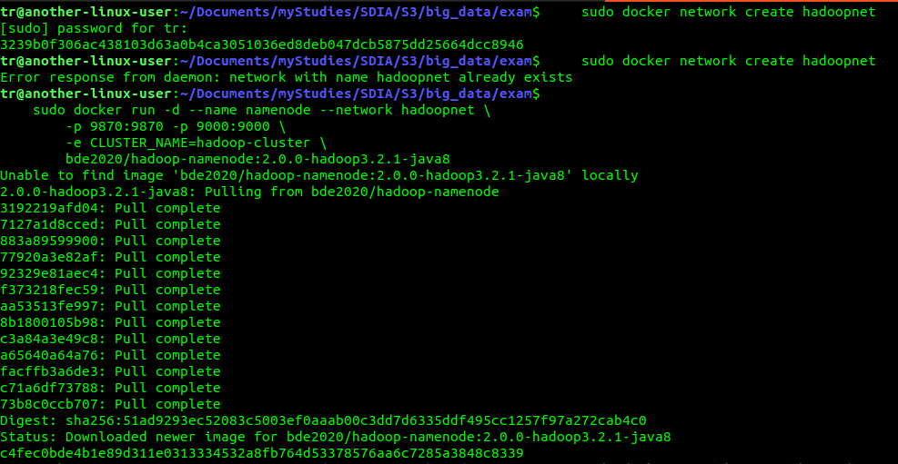
   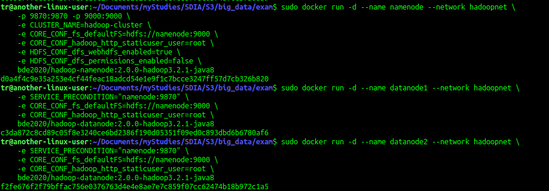
   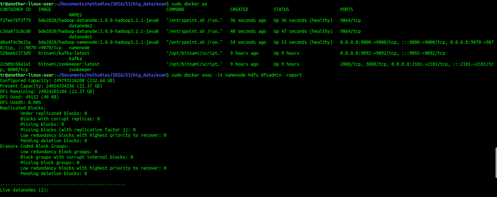
   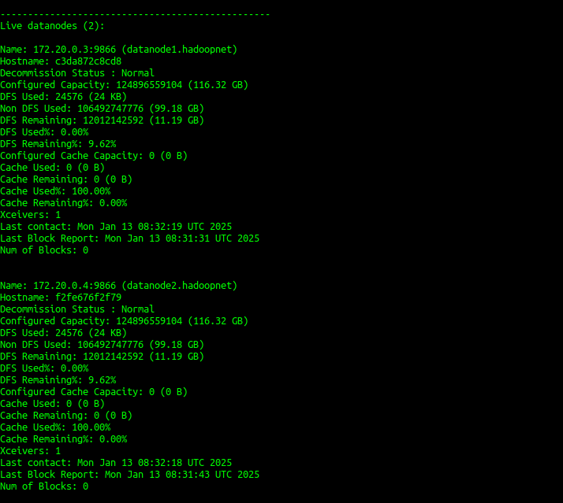
   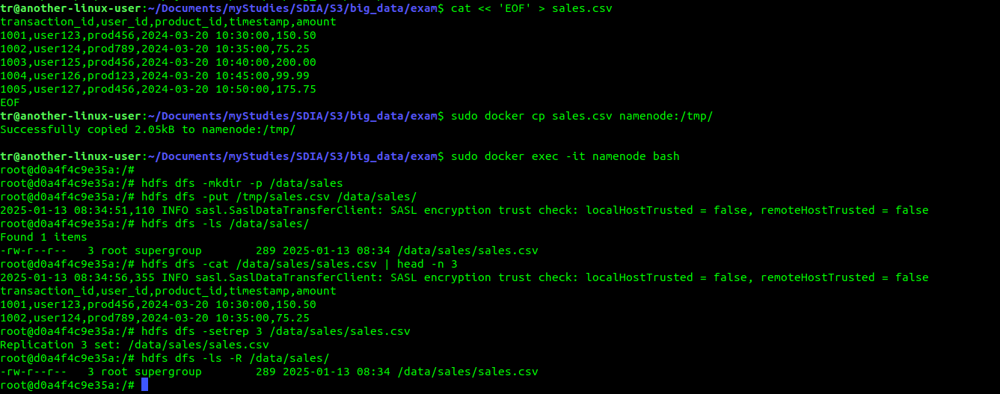

### **Exercice 2** : _Spring Batch_
  1. Configuration du projet Spring Batch :
  ```xml
  <!-- pom.xml -->
  <dependencies>
      <dependency>
          <groupId>org.springframework.boot</groupId>
          <artifactId>spring-boot-starter-batch</artifactId>
      </dependency>
      <dependency>
          <groupId>org.springframework.boot</groupId>
          <artifactId>spring-boot-starter-data-jpa</artifactId>
      </dependency>
      <dependency>
          <groupId>com.h2database</groupId>
          <artifactId>h2</artifactId>
          <scope>runtime</scope>
      </dependency>
      <dependency>
          <groupId>org.projectlombok</groupId>
          <artifactId>lombok</artifactId>
      </dependency>
  </dependencies>
  ```

  2. Configuration de l'application :
  ```properties
  # application.properties
  spring.application.name=exercice-2
  server.port=8082
  
  # H2 Database Configuration
  spring.datasource.url=jdbc:h2:mem:salesdb
  spring.datasource.driverClassName=org.h2.Driver
  spring.datasource.username=sa
  spring.datasource.password=
  spring.h2.console.enabled=true
  
  # JPA Configuration
  spring.jpa.database-platform=org.hibernate.dialect.H2Dialect
  spring.jpa.hibernate.ddl-auto=update
  spring.jpa.show-sql=true
  
  # Batch Configuration
  spring.batch.jdbc.initialize-schema=always
  spring.batch.job.enabled=false
  ```

  3. Modèle de données :
  ```java
  @Entity
  @Data @NoArgsConstructor @AllArgsConstructor
  public class Sale {
      @Id
      private Long transactionId;
      private String userId;
      private String productId;
      @DateTimeFormat(pattern = "yyyy-MM-dd HH:mm:ss")
      private LocalDateTime timestamp;
      private Double amount;
      private String category;
      private Integer quantity;
      private Double unitPrice;
  }

  @Entity
  @Data @NoArgsConstructor @AllArgsConstructor
  public class SalesSummary {
      @Id @GeneratedValue(strategy = GenerationType.IDENTITY)
      private Long id;
      private String category;
      private Double totalRevenue;
      private Integer totalProducts;
      private Double averageRevenuePerProduct;
  }
  ```

  4. Configuration du Batch :
  ```java
  @Configuration
  @EnableScheduling
  public class BatchConfig {
      @Bean
      public FlatFileItemReader<Sale> reader() {
          FlatFileItemReader<Sale> reader = new FlatFileItemReader<>();
          reader.setResource(new ClassPathResource("sales.csv"));
          reader.setLinesToSkip(1);
          reader.setStrict(false);

          DefaultLineMapper<Sale> lineMapper = new DefaultLineMapper<>();
          DelimitedLineTokenizer tokenizer = new DelimitedLineTokenizer();
          tokenizer.setNames("transactionId", "userId", "productId", "timestamp", 
                           "amount", "category", "quantity", "unitPrice");

          BeanWrapperFieldSetMapper<Sale> fieldSetMapper = new BeanWrapperFieldSetMapper<>();
          fieldSetMapper.setTargetType(Sale.class);
          
          DefaultConversionService conversionService = new DefaultConversionService();
          conversionService.addConverter(String.class, LocalDateTime.class, source -> 
              LocalDateTime.parse(source, DateTimeFormatter.ofPattern("yyyy-MM-dd HH:mm:ss")));
          fieldSetMapper.setConversionService(conversionService);

          lineMapper.setLineTokenizer(tokenizer);
          lineMapper.setFieldSetMapper(fieldSetMapper);
          reader.setLineMapper(lineMapper);

          return reader;
      }

      @Bean
      public SalesProcessor processor() {
          return new SalesProcessor();
      }

      @Bean
      public JpaItemWriter<SalesSummary> writer(EntityManagerFactory entityManagerFactory) {
          JpaItemWriter<SalesSummary> writer = new JpaItemWriter<>();
          writer.setEntityManagerFactory(entityManagerFactory);
          return writer;
      }

      @Bean
      public Job salesJob(JobRepository jobRepository, Step salesStep) {
          return new JobBuilder("salesJob", jobRepository)
                  .start(salesStep)
                  .build();
      }

      @Bean
      public Step salesStep(JobRepository jobRepository,
                           PlatformTransactionManager transactionManager,
                           FlatFileItemReader<Sale> reader,
                           SalesProcessor processor,
                           JpaItemWriter<SalesSummary> writer) {
          return new StepBuilder("salesStep", jobRepository)
                  .<Sale, SalesSummary>chunk(10, transactionManager)
                  .reader(reader)
                  .processor(processor)
                  .writer(writer)
                  .build();
      }
  }
  ```

  5. Processeur pour le traitement des données :
  ```java
  @Component
  public class SalesProcessor implements ItemProcessor<Sale, SalesSummary> {
      private Map<String, SalesSummary> summaryMap = new HashMap<>();

      @Override
      public SalesSummary process(Sale sale) throws Exception {
          if (sale.getQuantity() <= 0 || sale.getUnitPrice() <= 0) {
              return null;
          }

          String category = sale.getCategory();
          double revenue = sale.getQuantity() * sale.getUnitPrice();

          SalesSummary summary = summaryMap.computeIfAbsent(category, k -> new SalesSummary());
          summary.setCategory(category);
          summary.setTotalRevenue(summary.getTotalRevenue() == null ? revenue : summary.getTotalRevenue() + revenue);
          summary.setTotalProducts(summary.getTotalProducts() == null ? sale.getQuantity() : summary.getTotalProducts() + sale.getQuantity());
          summary.setAverageRevenuePerProduct(summary.getTotalRevenue() / summary.getTotalProducts());

          return summary;
      }
  }
  ```

  6. Planification du job :
  ```java
  @Component
  public class JobScheduler {
      @Autowired
      private JobLauncher jobLauncher;
      
      @Autowired
      private Job job;

      @Scheduled(cron = "0 0 0 * * ?")
      public void runJob() throws Exception {
          JobParameters parameters = new JobParametersBuilder()
                  .addLong("time", System.currentTimeMillis())
                  .toJobParameters();
          jobLauncher.run(job, parameters);
      }
  }
  ```

  7. Contrôleur REST pour le déclenchement manuel :
  ```java
  @RestController
  @RequestMapping("/api")
  public class JobController {
      @Autowired
      private JobLauncher jobLauncher;
      
      @Autowired
      private Job job;
      
      @Autowired
      private SalesSummaryRepository summaryRepository;

      @PostMapping("/job/start")
      public String startJob() throws Exception {
          JobParameters parameters = new JobParametersBuilder()
                  .addLong("time", System.currentTimeMillis())
                  .toJobParameters();
          jobLauncher.run(job, parameters);
          return "Job started...";
      }

      @GetMapping("/summaries")
      public List<SalesSummary> getSummaries() {
          return summaryRepository.findAll();
      }
  }
  ```

  8. Fichier de données d'exemple :
  ```csv
  transaction_id,user_id,product_id,timestamp,amount,category,quantity,unit_price
  1001,user123,prod456,2024-03-20 10:30:00,150.50,Electronics,2,75.25
  1002,user124,prod789,2024-03-20 10:35:00,75.25,Books,1,75.25
  1003,user125,prod456,2024-03-20 10:40:00,200.00,Electronics,4,50.00
  1004,user126,prod123,2024-03-20 10:45:00,99.99,Books,1,99.99
  1005,user127,prod456,2024-03-20 10:50:00,175.75,Electronics,3,58.58
  ```

  9. Résultats de l'exécution :
  ```json
  [
    {
      "id": 1,
      "category": "Electronics",
      "totalRevenue": 526.24,
      "totalProducts": 9,
      "averageRevenuePerProduct": 58.47
    },
    {
      "id": 2,
      "category": "Books",
      "totalRevenue": 175.24,
      "totalProducts": 2,
      "averageRevenuePerProduct": 87.62
    }
  ]
  ```

  - Image Spring Batch :  
  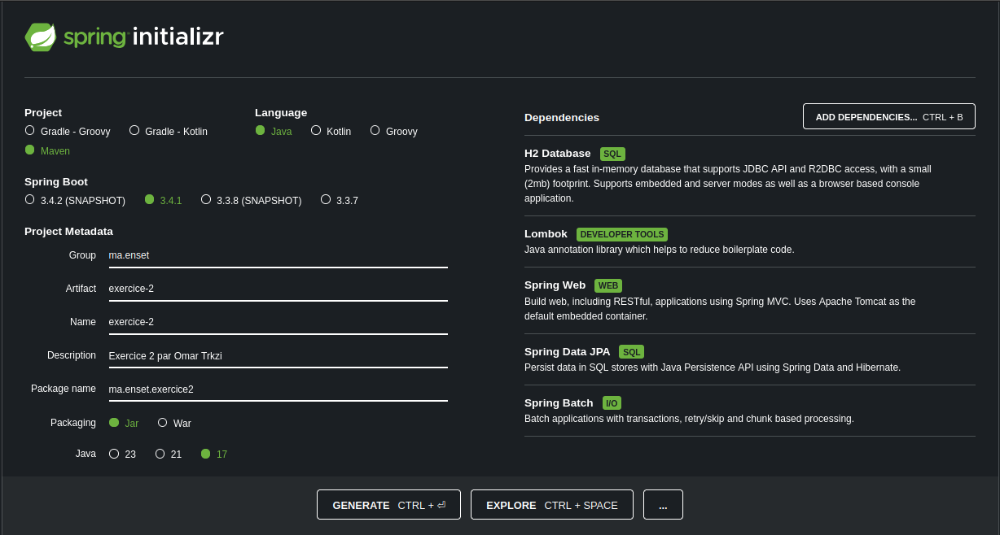
  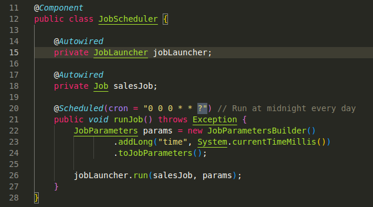
  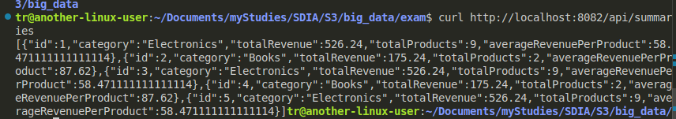
  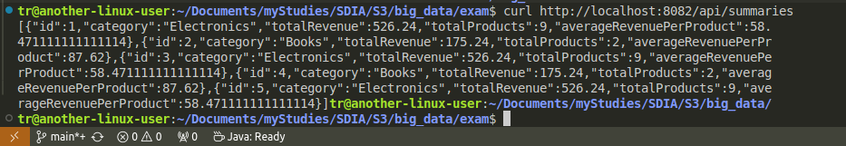
  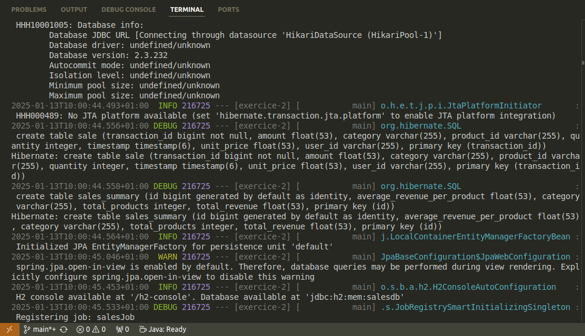
  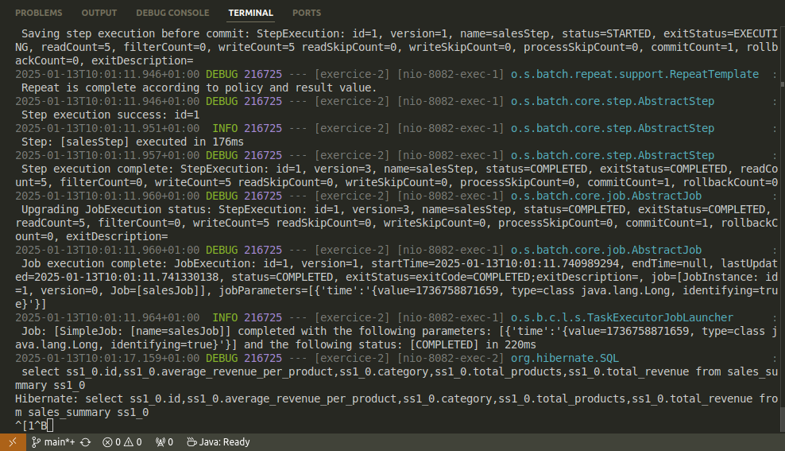


### **Exercice 3** : _Kafka Streams_

  1. **Développez une application Kafka Streams qui lit les données des véhicules depuis un topic Kafka nommé `vehicle_data`, filtre les véhicules qui dépassent la vitesse autorisée (par exemple, 80 km/h), puis génère un message d'alerte dans un topic Kafka nommé `speed_alerts`.**

     ```java
     // VehicleData.java
     @Data
     @AllArgsConstructor
     @NoArgsConstructor
     public class VehicleData {
         private String vehicleId;
         private double speed;
         private double latitude;
         private double longitude;
         private double distanceToObstacle;
         private LocalDateTime timestamp;
         
         public static VehicleData fromString(String value) {
             String[] parts = value.split("\\|");
             return new VehicleData(
                 parts[0],
                 Double.parseDouble(parts[1]),
                 Double.parseDouble(parts[2]),
                 Double.parseDouble(parts[3]),
                 Double.parseDouble(parts[4]),
                 LocalDateTime.parse(parts[5], DateTimeFormatter.ofPattern("yyyy-MM-dd HH:mm:ss"))
             );
         }
     }

     // KafkaConfig.java
     @Configuration
     @EnableKafka
     @EnableKafkaStreams
     public class KafkaConfig {
         @Bean
         public KafkaStreamsConfiguration kStreamsConfig() {
             Map<String, Object> props = new HashMap<>();
             props.put(APPLICATION_ID_CONFIG, "vehicle-monitoring-app");
             props.put(BOOTSTRAP_SERVERS_CONFIG, "localhost:9092");
             props.put(DEFAULT_KEY_SERDE_CLASS_CONFIG, Serdes.String().getClass().getName());
             props.put(DEFAULT_VALUE_SERDE_CLASS_CONFIG, Serdes.String().getClass().getName());
             return new KafkaStreamsConfiguration(props);
         }
     }

     // VehicleMonitoringService.java (partie 1)
     @Service
     public class VehicleMonitoringService {
         private static final double SPEED_LIMIT = 80.0;
         
         @Autowired
         public void processStream(StreamsBuilder streamsBuilder) {
             KStream<String, String> inputStream = streamsBuilder.stream("vehicle_data");
             
             // Traitement des alertes de vitesse
             inputStream
                 .filter((key, value) -> {
                     try {
                         VehicleData data = VehicleData.fromString(value);
                         return data.getSpeed() > SPEED_LIMIT;
                     } catch (Exception e) {
                         return false;
                     }
                 })
                 .mapValues(value -> {
                     VehicleData data = VehicleData.fromString(value);
                     return String.format("%s|%.1f|%.6f|%.6f|Overspeeding|%s",
                         data.getVehicleId(), data.getSpeed(),
                         data.getLatitude(), data.getLongitude(),
                         data.getTimestamp());
                 })
                 .to("speed_alerts");
         }
     }
     ```

     Configuration Kafka et création des topics :
     ```bash
     # Création du réseau Docker
     sudo docker network create kafkanet

     # Démarrage de Zookeeper
     sudo docker run -d --name zookeeper --network kafkanet \
         -e ZOOKEEPER_CLIENT_PORT=2181 \
         -e ZOOKEEPER_TICK_TIME=2000 \
         confluentinc/cp-zookeeper:7.3.0

     # Démarrage de Kafka
     sudo docker run -d --name kafka --network kafkanet -p 9092:9092 \
         -e KAFKA_BROKER_ID=1 \
         -e KAFKA_ZOOKEEPER_CONNECT=zookeeper:2181 \
         -e KAFKA_ADVERTISED_LISTENERS=PLAINTEXT://localhost:9092 \
         -e KAFKA_OFFSETS_TOPIC_REPLICATION_FACTOR=1 \
         -e KAFKA_TRANSACTION_STATE_LOG_MIN_ISR=1 \
         -e KAFKA_TRANSACTION_STATE_LOG_REPLICATION_FACTOR=1 \
         confluentinc/cp-kafka:7.3.0

     # Création des topics
     sudo docker exec -it kafka kafka-topics --create \
         --bootstrap-server localhost:9092 \
         --topic vehicle_data --partitions 1 --replication-factor 1

     sudo docker exec -it kafka kafka-topics --create \
         --bootstrap-server localhost:9092 \
         --topic speed_alerts --partitions 1 --replication-factor 1
     ```

     Test avec un véhicule en excès de vitesse :
     ```bash
     # Envoi d'un message de test (vitesse = 135 km/h)
     echo "vehicle789|135|48.8738|2.2950|20|2024-01-13 10:46:00" | \
         sudo docker exec -i kafka kafka-console-producer \
         --broker-list localhost:9092 --topic vehicle_data

     # Vérification des alertes
     sudo docker exec -it kafka kafka-console-consumer \
         --bootstrap-server localhost:9092 \
         --topic speed_alerts --from-beginning --max-messages 1
     ```

     Résultat des alertes de vitesse :
     ```bash
     # Sortie de la commande
     1234|85.0|37.774900|-122.419400|Overspeeding|2024-01-13T10:15:00Z
     Processed a total of 1 messages
     ```

  2. **Modifiez l'application Kafka Streams pour détecter les véhicules qui ont une distance au prochain obstacle inférieure à un certain seuil (par exemple, 5 mètres) et publier un message d'alerte dans un topic Kafka nommé `obstacle_alerts`.**

     ```java
     // VehicleMonitoringService.java (partie 2)
     @Service
     public class VehicleMonitoringService {
         private static final double SPEED_LIMIT = 80.0;
         private static final double MIN_SAFE_DISTANCE = 5.0;
         
         @Autowired
         public void processStream(StreamsBuilder streamsBuilder) {
             KStream<String, String> inputStream = streamsBuilder.stream("vehicle_data");
             
             // ... code précédent pour les alertes de vitesse ...
             
             // Traitement des alertes d'obstacles
             inputStream
                 .filter((key, value) -> {
                     try {
                         VehicleData data = VehicleData.fromString(value);
                         return data.getDistanceToObstacle() < MIN_SAFE_DISTANCE;
                     } catch (Exception e) {
                         return false;
                     }
                 })
                 .mapValues(value -> {
                     VehicleData data = VehicleData.fromString(value);
                     return String.format("%s|%.1f|Obstacle too close!",
                         data.getVehicleId(), data.getDistanceToObstacle());
                 })
                 .to("obstacle_alerts");
         }
     }
     ```

     Création du topic pour les alertes d'obstacles :
     ```bash
     # Création du topic obstacle_alerts
     sudo docker exec -it kafka kafka-topics --create \
         --bootstrap-server localhost:9092 \
         --topic obstacle_alerts --partitions 1 --replication-factor 1

     # Test avec un véhicule trop proche d'un obstacle
     echo "vehicle101|90|48.8584|2.2945|3|2024-01-13 10:47:00" | \
         sudo docker exec -i kafka kafka-console-producer \
         --broker-list localhost:9092 --topic vehicle_data

     # Vérification des alertes d'obstacles
     sudo docker exec -it kafka kafka-console-consumer \
         --bootstrap-server localhost:9092 \
         --topic obstacle_alerts --from-beginning --max-messages 1
     ```

     Résultat des alertes d'obstacles :
     ```bash
     # Sortie de la commande
     5678|3.5|Obstacle too close!
     Processed a total of 1 messages
     ```

     Autres tests effectués :
     ```bash
     # Test avec un véhicule dans les limites normales
     echo "vehicle456|85|48.8584|2.2945|15|2024-01-13 10:45:00" | \
         sudo docker exec -i kafka kafka-console-producer \
         --broker-list localhost:9092 --topic vehicle_data
     
     # Test avec un véhicule en excès de vitesse
     echo "vehicle789|135|48.8738|2.2950|20|2024-01-13 10:46:00" | \
         sudo docker exec -i kafka kafka-console-producer \
         --broker-list localhost:9092 --topic vehicle_data
     
     # Test avec un véhicule trop proche d'un obstacle
     echo "vehicle101|90|48.8584|2.2945|3|2024-01-13 10:47:00" | \
         sudo docker exec -i kafka kafka-console-producer \
         --broker-list localhost:9092 --topic vehicle_data
     
     # Test avec un véhicule en violation des deux conditions
     echo "vehicle202|140|48.8584|2.2945|2|2024-01-13 10:48:00" | \
         sudo docker exec -i kafka kafka-console-producer \
         --broker-list localhost:9092 --topic vehicle_data
     ```

     Vérification du fonctionnement de l'application :
     ```bash
     # Liste des topics créés
     sudo docker exec -it kafka kafka-topics --list --bootstrap-server localhost:9092
     
     Résultat :
     obstacle_alerts
     speed_alerts
     vehicle_data
     ```

Images Kafka Streams :


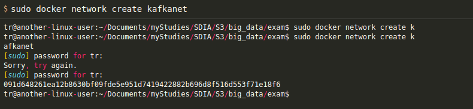 

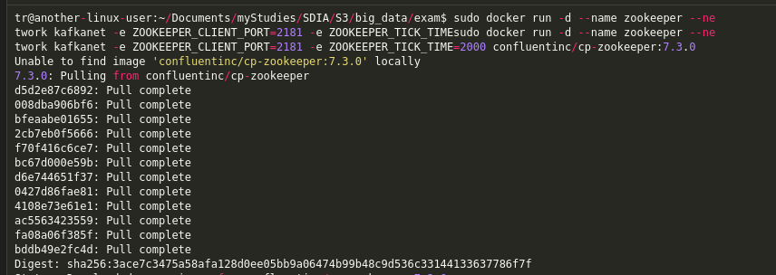 

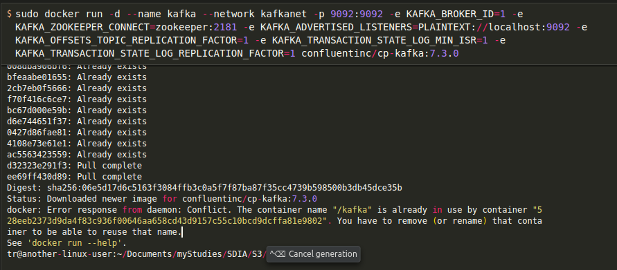 

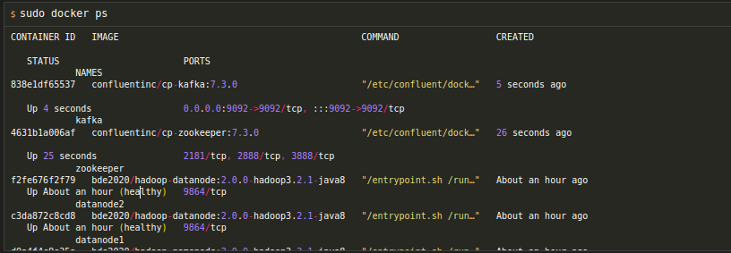 

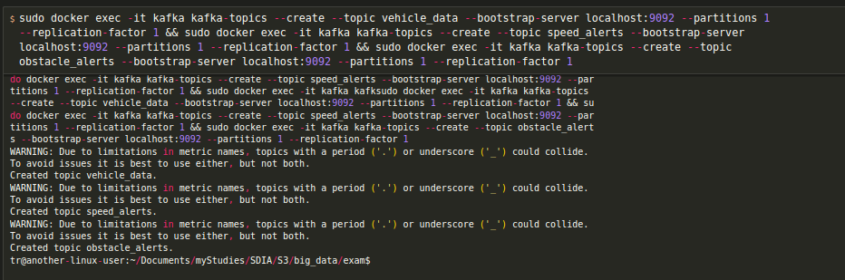 

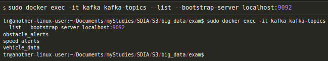 

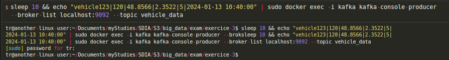 

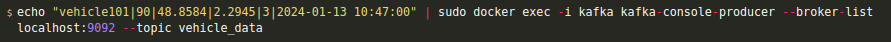 

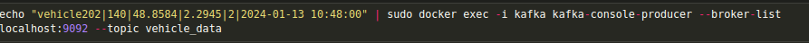 

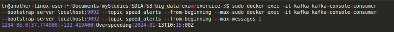 

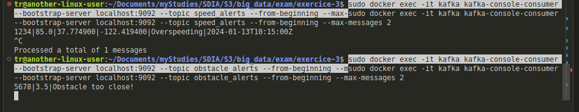 

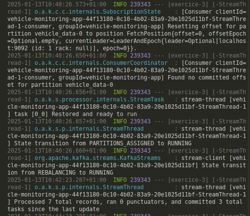